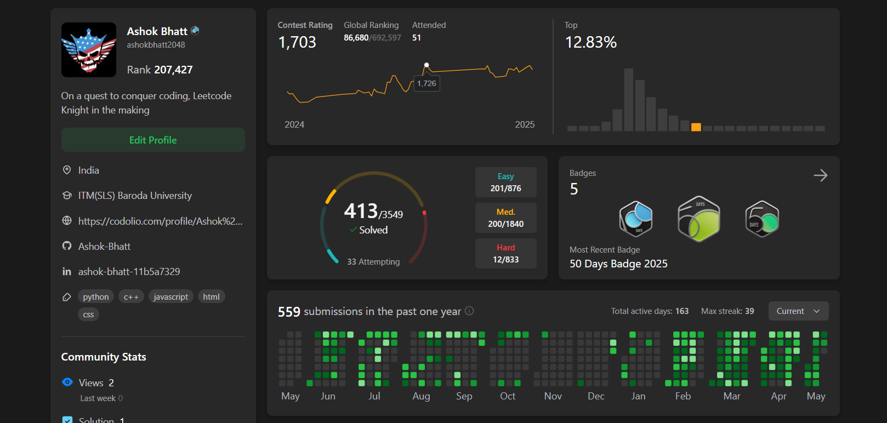

<h1 align="center">🚀 My LeetCode Journey</h1>

<p align="center">
  
  
  
</p>

<p>
  
</p>

---

## 📌 About This Repository

Welcome to my **LeetCode Solutions** repository!  
This is where I regularly upload solutions to coding problems from [LeetCode](https://leetcode.com/).  
You'll find my clean, optimized solutions mostly written in **C++** (some solutions may be submitted in python), with **well-commented code**.

---

## 🧑‍💻 My LeetCode Live Stats


## 🏆 My LeetCode Badges


> 📅 I believe in solving at least 1 problem every day — consistency over intensity!

---

## 📂 Folder Structure

```bash
📦LeetCode-Solutions/
├── TwoSum/
│   ├── submission1.cpp
│   ├── submission2.cpp
│   └── ...
├── AddTwoNumbers/
│   ├── submission1.cpp
│   ├── submission2.py
│   └── ...
├── README.md
└── ...
